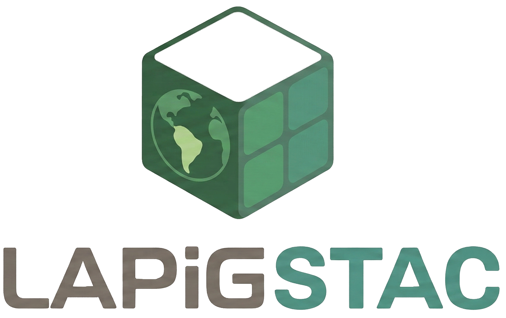
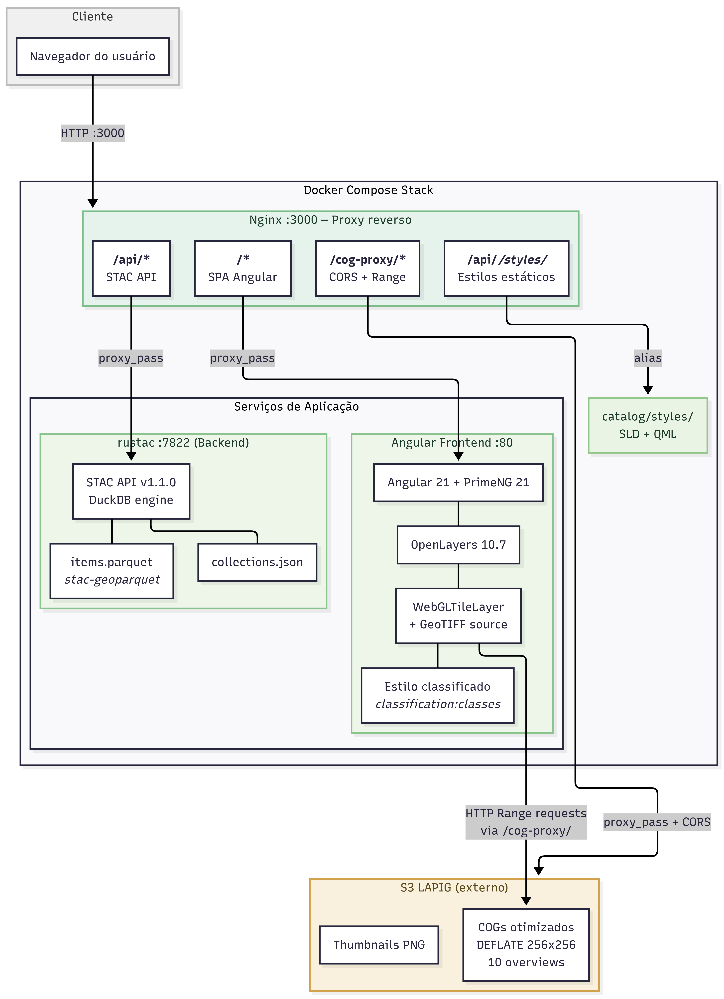
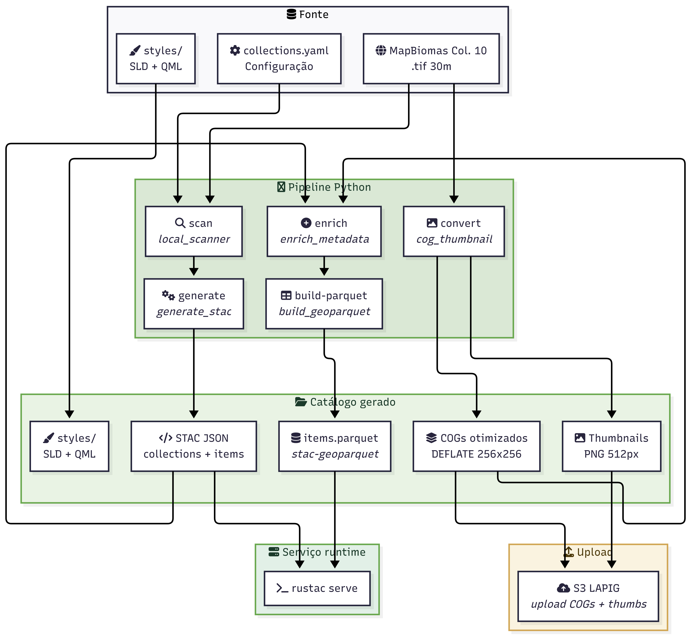
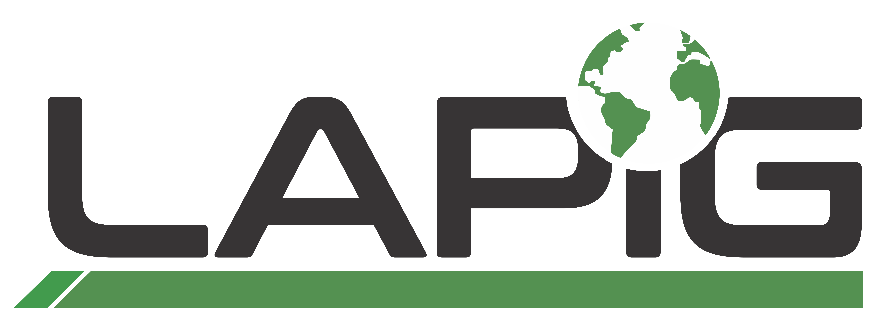
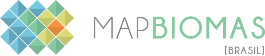

<p align="center">
  
</p>

<p align="center">
  <a href="https://stacspec.org/"></a>
  <a href="https://creativecommons.org/licenses/by-sa/4.0/"></a>
</p>

Catálogo de dados geoespaciais do **LAPIG/UFG** compatível com [STAC v1.1.0](https://stacspec.org/).

Disponibiliza coleções de pastagem (área e vigor) do MapBiomas como itens STAC com COGs otimizados, servidos dinamicamente via [stac-fastapi-pgstac](https://github.com/stac-utils/stac-fastapi-pgstac) (FastAPI + PostgreSQL/pgstac).

<p align="center">
  
</p>

## Arquitetura

### Infraestrutura (runtime)



### Pipeline de dados (offline)



### Componentes

| Componente | Tecnologia | Funcao |
|---|---|---|
| **API STAC** | [stac-fastapi-pgstac](https://github.com/stac-utils/stac-fastapi-pgstac) v5 + PostgreSQL/PostGIS + [pgstac](https://github.com/stac-utils/pgstac) v0.9 | Servidor STAC dinâmico com filter (CQL2), sort, fields e transactions prontos |
| **Browser** | Angular 21 + PrimeNG 21 + OpenLayers 10.7 | Visualizacao interativa com renderizacao WebGL de COGs |
| **Proxy** | Nginx 1.29 | Roteamento, CORS para COGs no S3, estilos estaticos (SLD/QML) |
| **Pipeline** | Python 3.11 + GDAL + Click | Geracao de catalogo STAC, conversao COG, enriquecimento de metadados |

## Início rápido

### Pré-requisitos

- Python >= 3.11
- Docker >= 24.0 (para produção)
- GDAL >= 3.9 (para conversão COG)
- [Just](https://github.com/casey/just) (opcional)

### 1. Instalar dependências

```bash
cd pipeline
uv sync
```

### 2. Pipeline completo

```bash
# Gerar metadados STAC a partir dos dados locais
uv run lapig-stac all -d ../data -o ../catalog

# Converter TIFFs para COG otimizados + thumbnails
uv run lapig-stac convert -d ../data -o ../catalog --cog-workers 4

# Enriquecer itens com metadados reais dos COGs
uv run lapig-stac enrich -d ../catalog

# Emitir ndjson para carga no pgstac (usado pelo build Docker e pelo
# entrypoint em runtime)
uv run lapig-stac export-ndjson -d ../catalog
```

### 3. Servir localmente (Docker Compose)

```bash
just serve   # sobe Postgres + API + SPA + nginx
```

O `stac-fastapi-pgstac` aplica migrações `pgstac` e carrega o catálogo em cada boot (idempotente via `upsert`).

### 4. Docker Compose (desenvolvimento completo)

```bash
docker compose up -d --build
```

| URL | Descrição |
|---|---|
| `http://localhost:3000` | Browser STAC |
| `http://localhost:3000/api` | API STAC (JSON) |
| `http://localhost:3000/api/collections` | Coleções |
| `http://localhost:3000/api/search` | Busca (POST) |

### Produção

A aplicação está disponível em produção no endereço:

| URL | Descrição |
|---|---|
| [`https://stac.lapig.iesa.ufg.br`](https://stac.lapig.iesa.ufg.br) | Browser STAC |
| [`https://stac.lapig.iesa.ufg.br/api`](https://stac.lapig.iesa.ufg.br/api) | API STAC (JSON) |
| [`https://stac.lapig.iesa.ufg.br/api/collections`](https://stac.lapig.iesa.ufg.br/api/collections) | Coleções |
| [`https://stac.lapig.iesa.ufg.br/api/search`](https://stac.lapig.iesa.ufg.br/api/search) | Busca (POST) |

O deploy é automatizado via GitHub Actions: cada push na branch `main` constrói a imagem Docker, publica no DockerHub e atualiza o serviço no Docker Swarm com TLS via Let's Encrypt.

## Coleções

| ID | Título | Período | Itens |
|---|---|---|---|
| `pasture-area` | MapBiomas Col. 10 — Área de Pastagem | 1985–2024 | 40 |
| `pasture-vigor` | MapBiomas Col. 10 — Vigor de Pastagem | 2000–2024 | 25 |

Cada item inclui:
- **COG** otimizado (DEFLATE, 256x256 tiles, 10 overviews)
- **Thumbnail** PNG estilizado (512x485 px)
- Metadados: `proj:epsg`, `proj:shape`, `raster:bands`, `file:size`, `file:checksum`
- Estilos: SLD (OGC) + QML (QGIS) por coleção

## Estrutura do projeto

```
lapig-stac/
├── browser-v2/               # Frontend Angular 21 + PrimeNG + OpenLayers
│   ├── src/app/features/     #   Módulos: search, catalog, item, map
│   └── Dockerfile            #   Build multi-stage (Node → Nginx)
├── pipeline/                  # Pipeline Python (scan → STAC → COG → enrich)
│   ├── pipeline/             #   Módulos: cli, generate_stac, cog_thumbnail, etc.
│   ├── config/               #   collections.yaml (definição das coleções)
│   └── styles/               #   SLD + QML (estilos de classificação)
├── catalog/                   # Artefatos gerados (não versionados, exceto styles/)
│   ├── styles/               #   SLD/QML servidos pelo Nginx
│   ├── pasture-area.json     #   Coleção limpa para rustac
│   └── pasture-vigor.json    #   Coleção limpa para rustac
├── docs/                      # Documentação técnica
├── infra/nginx/               # Configuração do proxy reverso
├── docker/prod/               # Dockerfile e configs de produção (CI/CD)
├── Dockerfile                 # Build da API STAC (rustac via pip)
├── docker-compose.yml         # Orquestração dos 3 serviços (desenvolvimento)
└── Justfile                   # Task runner para pipeline e Docker
```

## Documentação

- [Arquitetura](docs/ARCHITECTURE.md)
- [Conformidade STAC](docs/STAC-COMPLIANCE.md)
- [Deployment](docs/DEPLOYMENT.md)

## Parceiros

<p align="center">
  <a href="https://www.lapig.iesa.ufg.br"></a>
  &nbsp;&nbsp;&nbsp;&nbsp;
  <a href="https://ufg.br"></a>
  &nbsp;&nbsp;&nbsp;&nbsp;
  <a href="https://mapbiomas.org"></a>
  &nbsp;&nbsp;&nbsp;&nbsp;
  <a href="https://opengeohub.org"></a>
</p>

## Licença

Dados distribuídos sob [CC-BY-SA-4.0](https://creativecommons.org/licenses/by-sa/4.0/).
