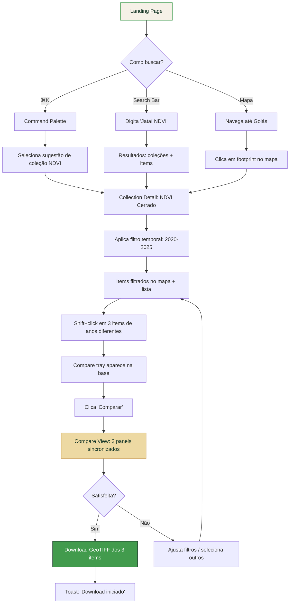
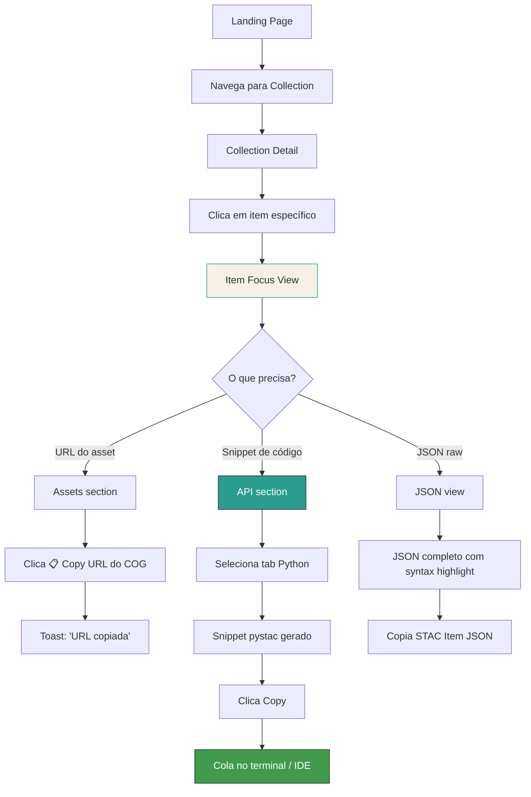
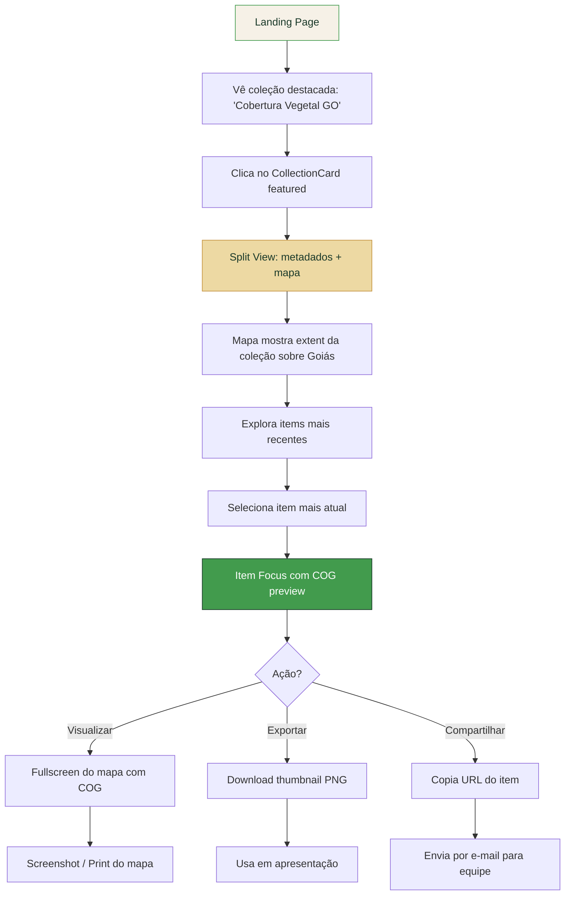

# LAPIG STAC Browser v2 — Proposta de Design Disruptivo

> **Versão:** 1.0.0  
> **Data:** 2026-04-09  
> **Stack:** Angular 21 · PrimeNG 21 (Aura) · Tailwind CSS v4 · OpenLayers 10.x  
> **Base:** Template Apollo PrimeNG + Identidade Visual LAPIG v1.0.0  

---

## FASE 1 — AUDITORIA DE IDENTIDADE VISUAL

### 1.1 Inventário de Assets

#### Logotipos

| Variante | Arquivo | Uso |
|---|---|---|
| PT-BR com subtítulo | `lapig-logo-v1-ptbr-com-subtitulo.svg/.png` | Uso formal, publicações nacionais |
| PT-BR sem subtítulo | `lapig-logo-v2-sem-subtitulo.svg/.png` | Uso geral, mais versátil |
| EN com subtítulo | `lapig-logo-v1-en-com-subtitulo.svg/.png` | Publicações internacionais |
| EN dark background | `lapig-logo-v2-en-com-subtitulo.svg/.png` | Backgrounds escuros |
| Ícone light | `lapig-icone.svg` / `64.png` / `128.png` | Favicon, avatar, mobile |
| Ícone dark | `lapig-icone-dark.svg` / `64.png` / `128.png` | Favicon em dark mode |

**Regras intocáveis:**
- Safe area mínima: x/2 em todos os lados (x = altura da letra L no wordmark)
- Tamanho mínimo legível: 64×64 px
- Nunca distorcer, recriar ou aplicar efeitos (sombras, gradientes, transforms)
- Backgrounds aprovados: branco/creme, Deep Forest, transparente

#### Paleta Cromática Completa

**Cores Primárias**

| Nome | HEX | HSL | OKLCH | Uso |
|---|---|---|---|---|
| Cerrado Green | `#429B4D` | hsl(128, 40%, 43%) | oklch(0.62 0.14 148) | Cor institucional principal |
| Deep Forest | `#1B3A2A` | hsl(149, 36%, 17%) | oklch(0.27 0.05 160) | Backgrounds escuros, títulos |
| Cream | `#F6F1E7` | hsl(40, 47%, 93%) | oklch(0.96 0.02 90) | Background dominante |

**Cores Secundárias**

| Nome | HEX | HSL | OKLCH | Uso |
|---|---|---|---|---|
| Tech Teal | `#2A9D8F` | hsl(173, 58%, 39%) | oklch(0.61 0.10 180) | Acentos tecnológicos, UI |
| Cerrado Gold | `#C4933F` | hsl(38, 52%, 51%) | oklch(0.67 0.13 75) | Destaques de dados, impacto |
| Earth Brown | `#6B4C3B` | hsl(22, 29%, 33%) | oklch(0.40 0.06 50) | Elementos terrosos |

**Cor de Alerta**

| Nome | HEX | HSL | Uso |
|---|---|---|---|
| Alert Red | `#C4533A` | hsl(10, 55%, 50%) | Apenas situações críticas |

**Neutros (9 níveis)**

| Nível | HEX | Uso |
|---|---|---|
| N9 (Black) | `#1A1A18` | Texto principal dark mode |
| N8 | `#2D2D2A` | Surfaces escuras |
| N7 (Dark Gray) | `#404040` | Bordas fortes |
| N6 | `#555550` | Texto secundário |
| N5 (Mid-Gray) | `#6B6B65` | Placeholders |
| N4 | `#8A8A82` | Ícones inativos |
| N3 (Light Gray) | `#ABABAA` | Divisores |
| N2 | `#D0D0CC` | Bordas leves |
| N1 | `#ECECEA` | Backgrounds elevados |
| White | `#FEFEFE` | Surface padrão |

**Cores de Suporte**

| Nome | HEX | Uso |
|---|---|---|
| Light Green | `#6DB56A` | Variante leve do verde |
| Gold Light | `#D4A84B` | Acento dourado |
| Gold Pale | `#EDD9A3` | Backgrounds cálidos |
| Sand | `#E8DCC8` | Tom neutro quente |
| Cream Warm | `#FBF8F1` | Variante creme mais quente |

**Gradientes**

| Nome | De → Para | Contexto |
|---|---|---|
| Cerrado | `#1B3A2A` → `#429B4D` | Dark backgrounds |
| Satellite | `#2A9D8F` → `#429B4D` | Contextos tecnológicos |
| Golden Hour | `#C4933F` → `#6B4C3B` | Contextos terrosos |

**Regra 60-30-10:** 60% Cream/White · 30% Green/Deep Forest · 10% Gold/Accents

#### Tipografia

| Função | Família | Pesos | Uso |
|---|---|---|---|
| Display/Títulos | **Exo 2** (Google Fonts) | 700, 800, 900 | Headlines, wordmark, títulos de seção |
| Body/UI | **DM Sans** (Google Fonts) | 400, 500, 600, 700 | Corpo, labels, formulários |
| Dados/Código | **JetBrains Mono** (Google Fonts) | 400, 600 | Metadados, coordenadas, snippets, overlines |

**Hierarquia tipográfica**

| Elemento | Família | Tamanho | Peso | Tracking | Line-height |
|---|---|---|---|---|---|
| h1 | Exo 2 | 2.5rem | 900 | -0.035em | 1.05 |
| h2 | Exo 2 | 1.8rem | 800 | -0.03em | 1.1 |
| h3 | Exo 2 | 1.3rem | 700 | -0.02em | 1.15 |
| h4 | DM Sans | 1rem | 700 | default | 1.3 |
| body | DM Sans | 0.92rem | 400 | default | 1.65 |
| caption | DM Sans | 0.75rem | 500 | default | 1.5 |
| overline | JetBrains Mono | 0.68rem | 600 | 0.12em (uppercase) | 1.3 |
| data | JetBrains Mono | 2rem | 600 | default | 1.1 |

#### Elementos Gráficos

1. **Curvas de nível (Contour Lines)** — Padrão SVG com ondulações topográficas. Linhas NUNCA se cruzam ou tocam. Stroke: `#429B4D`, largura 0.8–1.5px, opacidade 5–32%. Uso: backgrounds sutis.

2. **Hexágono (Hexagon Frame)** — Moldura para fotos/ícones. Stroke `#429B4D`, 2.5px. Não usar como background.

3. **Variantes:** contour-lines-gold.svg (para dark backgrounds), contour-lines-completo.svg (versão densa).

#### Tom de Voz

*"Ciência que enxerga o território"* — institucional, preciso, acessível. Linguagem técnica com clareza. Sem jargão desnecessário; dados falam por si com formatação elegante.

---

### 1.2 DNA Visual — Extração de Princípios

**5 Palavras-chave:**
1. **Territorial** — enraizado no Cerrado, não genérico
2. **Científico** — rigor nos dados, precisão nos detalhes
3. **Orgânico** — formas da natureza (curvas de nível, hexágonos de colmeia)
4. **Acessível** — ciência para todos, não apenas para especialistas
5. **Contemporâneo** — tecnologia de ponta com estética moderna

**Tensões criativas:**
- *Institucional* vs. *Inovador* — UFG/LAPIG é uma instituição pública, mas o produto precisa ser disruptivo
- *Técnico* vs. *Humano* — dados GIS são densos, mas a interface precisa ser acolhedora
- *Cerrado* vs. *Global* — identidade brasileira que funciona internacionalmente
- *Profundidade* vs. *Leveza* — informação rica sem sobrecarregar

**Oportunidades de extensão:**
- Curvas de nível como sistema generativo para backgrounds (variações procedurais)
- Hexágono como unidade modular de grid para cards e ícones
- Gradiente Cerrado como assinatura visual em mapas (tint de raster)
- JetBrains Mono como identidade tipográfica diferenciadora em metadados
- Dourado como acento para estados de "descoberta" e "seleção"

**Restrições hard:**
- Nunca alterar logotipos ou proporções
- Alert Red (`#C4533A`) reservado exclusivamente para erros críticos
- Curvas de nível nunca se cruzam (respeitam topologia)
- Mínimo de 60% de superfície neutra (creme/branco)
- Sem tipografias fora de Exo 2, DM Sans, JetBrains Mono

---

### 1.3 Design Tokens Derivados

```json
{
  "color": {
    "brand": {
      "primary": "#429B4D",
      "primary-light": "#6DB56A",
      "secondary": "#2A9D8F",
      "accent": "#C4933F",
      "accent-light": "#D4A84B",
      "accent-pale": "#EDD9A3",
      "earth": "#6B4C3B",
      "deep": "#1B3A2A"
    },
    "semantic": {
      "success": "#429B4D",
      "warning": "#C4933F",
      "error": "#C4533A",
      "info": "#2A9D8F"
    },
    "surface": {
      "ground": "#F6F1E7",
      "ground-warm": "#FBF8F1",
      "card": "#FEFEFE",
      "elevated": "#ECECEA",
      "sand": "#E8DCC8",
      "overlay": "rgba(27, 58, 42, 0.85)"
    },
    "surface-dark": {
      "ground": "#1A1A18",
      "card": "#2D2D2A",
      "elevated": "#404040",
      "overlay": "rgba(26, 26, 24, 0.9)"
    },
    "neutral": {
      "900": "#1A1A18",
      "800": "#2D2D2A",
      "700": "#404040",
      "600": "#555550",
      "500": "#6B6B65",
      "400": "#8A8A82",
      "300": "#ABABAA",
      "200": "#D0D0CC",
      "100": "#ECECEA",
      "50": "#FEFEFE"
    },
    "map": {
      "raster-tint": "rgba(66, 155, 77, 0.12)",
      "vector-fill": "rgba(42, 157, 143, 0.25)",
      "vector-stroke": "#2A9D8F",
      "selection": "#C4933F",
      "selection-fill": "rgba(196, 147, 63, 0.3)",
      "highlight": "#6DB56A",
      "footprint": "rgba(66, 155, 77, 0.4)",
      "footprint-hover": "rgba(66, 155, 77, 0.7)"
    },
    "gradient": {
      "cerrado": "linear-gradient(135deg, #1B3A2A 0%, #429B4D 100%)",
      "satellite": "linear-gradient(135deg, #2A9D8F 0%, #429B4D 100%)",
      "golden-hour": "linear-gradient(135deg, #C4933F 0%, #6B4C3B 100%)",
      "hero": "linear-gradient(160deg, #1B3A2A 0%, #2A9D8F 50%, #429B4D 100%)"
    }
  },
  "typography": {
    "display": {
      "family": "'Exo 2', system-ui, sans-serif",
      "weight": "900",
      "tracking": "-0.035em",
      "line-height": "1.05"
    },
    "heading": {
      "family": "'Exo 2', system-ui, sans-serif",
      "weight-h2": "800",
      "weight-h3": "700",
      "tracking": "-0.02em",
      "line-height": "1.1"
    },
    "body": {
      "family": "'DM Sans', system-ui, sans-serif",
      "weight": "400",
      "weight-strong": "600",
      "tracking": "normal",
      "line-height": "1.65"
    },
    "mono": {
      "family": "'JetBrains Mono', 'Fira Code', monospace",
      "weight": "400",
      "weight-bold": "600",
      "tracking": "normal",
      "line-height": "1.5"
    },
    "caption": {
      "family": "'DM Sans', system-ui, sans-serif",
      "weight": "500",
      "size": "0.75rem",
      "line-height": "1.5"
    },
    "overline": {
      "family": "'JetBrains Mono', monospace",
      "weight": "600",
      "size": "0.68rem",
      "tracking": "0.12em",
      "transform": "uppercase",
      "line-height": "1.3"
    }
  },
  "spacing": {
    "unit": "4px",
    "scale": {
      "0": "0",
      "1": "4px",
      "2": "8px",
      "3": "12px",
      "4": "16px",
      "5": "20px",
      "6": "24px",
      "8": "32px",
      "10": "40px",
      "12": "48px",
      "16": "64px",
      "20": "80px",
      "24": "96px"
    }
  },
  "radius": {
    "none": "0",
    "sm": "4px",
    "md": "8px",
    "lg": "12px",
    "xl": "16px",
    "2xl": "24px",
    "full": "9999px"
  },
  "elevation": {
    "1": "0 1px 3px rgba(27, 58, 42, 0.08), 0 1px 2px rgba(27, 58, 42, 0.06)",
    "2": "0 4px 12px rgba(27, 58, 42, 0.10), 0 2px 4px rgba(27, 58, 42, 0.06)",
    "3": "0 10px 30px rgba(27, 58, 42, 0.12), 0 4px 8px rgba(27, 58, 42, 0.08)",
    "map": "0 2px 8px rgba(0, 0, 0, 0.25)",
    "overlay": "0 16px 48px rgba(27, 58, 42, 0.20)"
  },
  "motion": {
    "fast": "120ms",
    "normal": "250ms",
    "slow": "400ms",
    "page": "350ms",
    "easing": {
      "default": "cubic-bezier(0.25, 0.1, 0.25, 1)",
      "spring": "cubic-bezier(0.34, 1.56, 0.64, 1)",
      "decelerate": "cubic-bezier(0, 0, 0.2, 1)",
      "accelerate": "cubic-bezier(0.4, 0, 1, 1)"
    }
  },
  "breakpoints": {
    "sm": "640px",
    "md": "768px",
    "lg": "1024px",
    "xl": "1280px",
    "2xl": "1440px",
    "3xl": "1920px"
  }
}
```

---

## FASE 2 — PROPOSTA DE STAC BROWSER

### 2.1 Conceito de Design

#### Manifesto (3 linhas)

> **Dados geoespaciais merecem uma interface à altura da ciência que os produz.**  
> **Não é um painel de controle. É um instrumento de descoberta.**  
> **Cerrado é a raiz. O mundo é a escala.**

#### Referências Visuais

| # | Referência | O que se aplica |
|---|---|---|
| 1 | **Linear** (linear.app) | Command palette, busca universal, transições fluidas entre views, sensação de velocidade sem sacrificar profundidade |
| 2 | **Apple Maps** (iOS/macOS) | Mapa como protagonista imersivo, cards flutuantes sobre o mapa, progressive disclosure ao selecionar pontos |
| 3 | **Stripe Docs** (stripe.com/docs) | Snippets de código com tabs por linguagem, documentação que é produto, API como first-class citizen |
| 4 | **Figma** (figma.com) | Split views redimensionáveis, múltiplos painéis coexistindo, inspeção de propriedades em painel lateral |
| 5 | **Arc Browser** | Sidebar minimalista com hierarquia, command bar central, estética que não parece "app corporativo" |
| 6 | **Raycast** | Command palette com fuzzy search, ações rápidas, preview inline de resultados |
| 7 | **Google Earth** (web) | Transição fly-to entre locais, immersive storytelling com dados, layers como narrativa |
| 8 | **Obsidian** (obsidian.md) | Navegação em grafos, linking entre entidades, dark mode que não é inversão |

#### Anti-patterns a Evitar

- [ ] Dashboard com sidebar infinita de filtros à esquerda
- [ ] Mapa fullscreen com painel colapsável genérico sem identidade
- [ ] Tabela CRUD com mapa minúsculo no canto
- [ ] Interface que exige manual de 30 páginas
- [ ] Formulário de busca separado do mapa (busca e mapa são UMA coisa)
- [ ] Dropdowns em cascata para selecionar satélite → sensor → banda → data
- [ ] Paginação com "Exibindo 1-10 de 34.521 resultados"
- [ ] Loading spinner centralizado sem indicação de progresso
- [ ] Cards genéricos retangulares sem hierarquia visual
- [ ] Dark mode como "inversão de cores" do light mode
- [ ] Metadados em tabela HTML básica sem formatação
- [ ] Footer ocupando 200px com links de copyright

---

### 2.2 Arquitetura de Informação

#### Personas e Fluxos Primários

**Persona 1: Dra. Marina — Pesquisadora**
- Ecóloga da UFMG estudando desmatamento no Cerrado goiano
- Busca: séries temporais de NDVI para o município de Jataí entre 2020–2025
- Fluxo: Command palette → busca "Jataí NDVI" → filtra temporalmente → compara 3 items → exporta GeoTIFF

**Persona 2: Lucas — Desenvolvedor**
- Dev Python na Embrapa, integrando dados LAPIG em pipeline de análise
- Busca: endpoint da API, snippet pystac, URL do COG para download programático
- Fluxo: Navega collection → clica item → aba "API" → copia snippet Python → testa no terminal

**Persona 3: Secretária Ana — Gestora**
- Diretora de meio ambiente do estado de Goiás
- Busca: visualização rápida da cobertura vegetal + download de relatório
- Fluxo: Landing → clica coleção destacada → visualiza no mapa → exporta PNG do mapa + metadados

#### Hierarquia de Navegação

```
Nível 0: Command Palette (⌘K) — busca universal + ações rápidas
         ↓
Nível 1: ┌─────────────┬──────────────┬───────────────┐
         │ Explorar     │ Buscar       │ API Playground│
         │ (Catálogo)   │ (Search)     │ (Dev Tools)   │
         └──────┬──────┴──────┬───────┴───────────────┘
                ↓             ↓
Nível 2: ┌──────────┐  ┌─────────────┐
         │Collection │  │Search Results│
         │ Detail    │  │ (Map + List) │
         └────┬─────┘  └──────┬──────┘
              ↓               ↓
Nível 3: ┌─────────┐  ┌──────────┐  ┌──────────────┐
         │Item Focus│  │Compare   │  │Download/     │
         │ (Detail) │  │ View     │  │ Export       │
         └─────────┘  └──────────┘  └──────────────┘
```

#### Micro-interações Chave

**Busca por localização:**
- Usuário digita no campo de busca (estado: idle → focused com borda `#2A9D8F`)
- Debounce 300ms → geocoding via Nominatim
- Sugestões aparecem com staggered fade-in (50ms entre items)
- Selecionar local → mapa faz fly-to com easing decelerate (800ms)
- Bbox do resultado é exibido como retângulo dourado (`#C4933F`) no mapa

**Filtro temporal:**
- Timeline horizontal na base do mapa (quando coleção selecionada)
- Densidade de items representada como heatmap em barras verticais (tons de verde)
- Drag para selecionar range → items no mapa atualizam com crossfade (250ms)
- Tooltip mostra contagem e data exata ao hover

**Preview de COG:**
- Thumbnail carrega primeiro (blur-up de 20px → nítido em 300ms)
- Clique → COG inicia renderização progressiva: tile central → vizinhos em espiral
- Controle de bandas aparece como floating pill na base do preview
- Transição entre combinações de bandas com crossfade suave (200ms)

**Seleção múltipla para comparação:**
- Shift+click em items adiciona ao "tray" de comparação (slide-up na base)
- Badge dourado no canto do card indica seleção
- Tray mostra thumbnails com "×" para remover
- Botão "Comparar" pulsa suavemente quando ≥2 items selecionados

**Transição Catálogo ↔ Mapa:**
- Toggle no header alterna entre Catalog View e Map View
- Shared element transition: card de coleção "voa" para virar footprint no mapa
- Em Split View: divisor arrastável com snap points em 30%, 50%, 70%

**Command Palette (⌘K):**
- Overlay com backdrop blur (8px) em Deep Forest com 85% opacidade
- Input com autocompletar fuzzy (score: título > keywords > descrição)
- Seções: "Coleções", "Items Recentes", "Ações", "Navegação"
- Preview do resultado à direita (thumbnail + extents + provider)
- Enter → navega; Tab → preenche filtro; Esc → fecha

---

### 2.3 Layout System

#### Breakpoints e Comportamento Responsivo

| Breakpoint | Nome | Layout | Mapa | Navegação |
|---|---|---|---|---|
| < 640px | Mobile | Stack vertical | Fullscreen toggle, bottom sheet | Bottom nav (3 ícones) |
| 640–1024px | Tablet | Split 40/60 vertical | Redimensionável | Top bar colapsada |
| 1024–1440px | Desktop | Fluid panels | Multi-panel side-by-side | Sidebar slim + top bar |
| > 1440px | Wide | Dashboard mode | Picture-in-picture | Sidebar expandida |

#### Grid e Spacing

- **Base:** 8px (2 × spacing unit)
- **Colunas:** 12 colunas com gutters de 24px (desktop), 16px (tablet), 12px (mobile)
- **Content width:** max 1440px com padding lateral de 32px
- **Card grid:** Auto-fill com `minmax(320px, 1fr)` para responsividade natural

#### Modos de Visualização

**1. Catalog View (Explorar)**
```
┌──────────────────────────────────────────────────────┐
│  [Logo]  [Breadcrumb ...]         [⌘K]  [🌙]  [👤]  │
├──────┬───────────────────────────────────────────────┤
│      │  OVERLINE: COLEÇÕES DO CATÁLOGO               │
│ Side │  ┌─────────┐ ┌─────────┐ ┌─────────┐         │
│ bar  │  │ Card    │ │ Card    │ │ Card    │         │
│      │  │ thumb   │ │ thumb   │ │ thumb   │         │
│ Tree │  │ title   │ │ title   │ │ title   │         │
│      │  │ extent  │ │ extent  │ │ extent  │         │
│      │  │ mini-map│ │ mini-map│ │ mini-map│         │
│      │  └─────────┘ └─────────┘ └─────────┘         │
│      │  ┌─────────┐ ┌─────────┐ ┌─────────┐         │
│      │  │ ...     │ │ ...     │ │ ...     │         │
│      │  └─────────┘ └─────────┘ └─────────┘         │
└──────┴───────────────────────────────────────────────┘
```

**2. Map View (Busca/Mapa Imersivo)**
```
┌──────────────────────────────────────────────────────┐
│  [Logo]  [Search Bar ═══════════]  [Filters]  [⌘K]  │
├──────────────────────────────────────────────────────┤
│                                                      │
│              M A P A   I M E R S I V O               │
│                                                      │
│  ┌──────────┐                     ┌────────────────┐ │
│  │ Results  │                     │ Layer Control  │ │
│  │ ┌──────┐ │                     │ □ Basemap      │ │
│  │ │Item 1│ │                     │ □ Footprints   │ │
│  │ └──────┘ │                     │ □ COG Preview  │ │
│  │ ┌──────┐ │                     └────────────────┘ │
│  │ │Item 2│ │                                        │
│  │ └──────┘ │    ┌──────────────────────┐            │
│  └──────────┘    │ ▪ Temporal Timeline ▪│            │
│                  └──────────────────────┘            │
└──────────────────────────────────────────────────────┘
```

**3. Split View (Catálogo + Mapa)**
```
┌──────────────────────────────────────────────────────┐
│  [Logo]  [Breadcrumb]              [⌘K]  [🌙]  [👤] │
├──────────────────────┬───────────────────────────────┤
│  Collection Detail   │                               │
│  ─────────────────   │      M A P A                  │
│  Description...      │                               │
│                      │      [footprints]             │
│  ITEMS               │                               │
│  ┌──────┐ ┌──────┐  │◄──► drag to resize            │
│  │Item 1│ │Item 2│  │                               │
│  └──────┘ └──────┘  │                               │
│  ┌──────┐ ┌──────┐  │                               │
│  │Item 3│ │Item 4│  │                               │
│  └──────┘ └──────┘  │                               │
└──────────────────────┴───────────────────────────────┘
```

**4. Focus View (Item Detail)**
```
┌──────────────────────────────────────────────────────┐
│  [← Back]  [Collection Name]       [⌘K]  [🌙]  [👤] │
├──────────────────────────────────────────────────────┤
│  ┌──────────────────────────────────────────────────┐│
│  │  COG PREVIEW / MAPA DO ITEM                      ││
│  │  [Band selector: R G B NIR]  [Zoom] [Fullscreen] ││
│  └──────────────────────────────────────────────────┘│
│                                                      │
│  ┌─ Metadata ──────┐  ┌─ Assets ─────────────────┐  │
│  │ datetime         │  │ ┌──────────────────────┐ │  │
│  │ platform         │  │ │ visual.tif  [↓] [📋] │ │  │
│  │ cloud_cover: 12% │  │ │ COG · 234MB · EPSG   │ │  │
│  │ gsd: 10m         │  │ └──────────────────────┘ │  │
│  │ eo:bands [table] │  │ ┌──────────────────────┐ │  │
│  │ proj:epsg: 4326  │  │ │ thumbnail   [↓] [📋] │ │  │
│  └──────────────────┘  │ └──────────────────────┘ │  │
│                        └──────────────────────────┘  │
│  ┌─ API ──────────────────────────────────────────┐  │
│  │ [Python] [JavaScript] [cURL] [GDAL]            │  │
│  │ ```python                                      │  │
│  │ import pystac_client                           │  │
│  │ catalog = Client.open("...")                    │  │
│  │ item = catalog.get_item("...")                  │  │
│  │ ```                                     [Copy] │  │
│  └────────────────────────────────────────────────┘  │
│                                                      │
│  ┌─ JSON ─────────────────────────────────────────┐  │
│  │ { "type": "Feature", "stac_version": "1.1.0",  │  │
│  │   "id": "...", ... }                    [Copy]  │  │
│  └────────────────────────────────────────────────┘  │
└──────────────────────────────────────────────────────┘
```

**5. Compare View (Comparação)**
```
┌──────────────────────────────────────────────────────┐
│  [← Back]  Comparando 3 items       [⌘K]  [🌙]     │
├──────────────────────────────────────────────────────┤
│  ┌──────────────┐ ┌──────────────┐ ┌──────────────┐ │
│  │  Preview A   │ │  Preview B   │ │  Preview C   │ │
│  │  2020-03-15  │ │  2022-03-15  │ │  2024-03-15  │ │
│  │              │ │              │ │              │ │
│  │  [synced     │ │  viewport    │ │  across]     │ │
│  │              │ │              │ │              │ │
│  └──────────────┘ └──────────────┘ └──────────────┘ │
│  ───────────────── Metadata Diff ──────────────────  │
│  │ cloud_cover  │    5%     │   12%    │    3%    │  │
│  │ gsd          │   10m     │   10m    │   10m    │  │
│  │ platform     │ Sentinel  │ Sentinel │ Sentinel │  │
└──────────────────────────────────────────────────────┘
```

---

### 2.4 Componentes Chave — Design Specs

#### 1. SearchBar Universal

**Propósito:** Busca unificada de coleções, items, locais e ações. Ponto de entrada primário da aplicação.

**Anatomia:**
- Container com borda 1px `--neutral-200`, radius `--radius-lg`
- Ícone de lupa à esquerda (`pi pi-search`)
- Input text com placeholder "Buscar coleções, locais, dados..."
- Chip area para filtros ativos (datetime, bbox, collection)
- Atalho `⌘K` badge à direita
- Dropdown de sugestões (max 8 items)

**Estados:**
- Default: borda `--neutral-200`, background `--surface-card`
- Focused: borda `--brand-secondary` (Tech Teal), shadow `--elevation-2`
- With results: dropdown aberto com backdrop blur
- Loading: skeleton shimmer nos resultados
- Empty: "Nenhum resultado para \"{query}\". Tente termos mais amplos."
- Error: mensagem inline com ícone `pi pi-exclamation-triangle`

**Variantes:**
- `size="compact"` — para topbar (40px altura)
- `size="hero"` — para landing page (56px altura, tipografia maior)
- `inline-filters` — com chips de filtro dentro do input

**Acessibilidade:**
- `role="combobox"`, `aria-expanded`, `aria-autocomplete="list"`
- `aria-activedescendant` para navegação nos resultados
- Keyboard: `↑↓` navegar, `Enter` selecionar, `Esc` fechar, `Tab` autocomplete
- Contraste: texto sobre fundo ≥ 4.5:1

**PrimeNG:** Baseado em `p-autocomplete` + `p-chip` + custom overlay.

---

#### 2. CollectionCard

**Propósito:** Representação visual de uma coleção STAC em grid/lista. Porta de entrada para exploração.

**Anatomia:**
- Container card com radius `--radius-lg`, elevation `--elevation-1`
- Thumbnail (aspect ratio 16:9) com gradient overlay no bottom
- Overline: provider name em JetBrains Mono uppercase
- Título: h3 Exo 2 700
- Descrição: 2 linhas com ellipsis, DM Sans 400
- Extent temporal: badge com ícone de calendário
- Mini-mapa: bounding box da coleção renderizado em canvas 80×60px
- Keywords: max 3 chips com overflow "+N"
- Footer: contagem de items + data de última atualização

**Estados:**
- Default: elevation-1, borda transparente
- Hover: elevation-2, borda `--brand-primary` 1px, translate-y -2px
- Active/Selected: borda `--accent` 2px, badge dourado
- Loading: skeleton com shimmer (thumbnail + 3 linhas de texto)
- Error: placeholder com ícone e retry button

**Variantes:**
- `view="card"` — card vertical (padrão)
- `view="list"` — horizontal com thumbnail à esquerda (120×80px)
- `featured` — dobro do tamanho no grid, thumbnail hero

**Acessibilidade:**
- `role="article"`, `aria-label="{title} - {provider}"`
- Focusable via Tab, Enter para navegar
- Mini-mapa: `aria-hidden="true"` (decorativo)
- Contraste título/fundo ≥ 7:1 (AAA)

**PrimeNG:** Baseado em `p-card` customizado + `p-chip` + `p-skeleton`.

---

#### 3. ItemCard

**Propósito:** Card compacto para um item STAC individual em resultados de busca ou lista de coleção.

**Anatomia:**
- Thumbnail compacto (aspect ratio 4:3)
- Badge de cloud cover (canto superior direito): verde ≤20%, amarelo 20–50%, vermelho >50%
- Data: formatada "15 Mar 2024"
- Resolução badge: "10m"
- Indicador de bandas: dots coloridos representando bandas disponíveis
- Checkbox de seleção (canto superior esquerdo, para comparação)

**Estados:**
- Default: borda sutil `--neutral-200`
- Hover: elevation-2, thumbnail zoom 1.03 (transform scale)
- Selected: borda `--accent` 2px, checkbox checked dourado
- In compare tray: opacidade reduzida, badge "Na comparação"
- Loading: skeleton card

**PrimeNG:** Custom component com `p-badge`, `p-checkbox`, `p-image`.

---

#### 4. TemporalNavigator

**Propósito:** Navegação visual ao longo do tempo para séries temporais de items. Contexto: base do mapa.

**Anatomia:**
- Container horizontal fixo na base do mapa (height 64px)
- Eixo temporal com ticks (anos, meses, dias conforme zoom)
- Barras verticais de densidade (heatmap: altura proporcional à contagem)
- Range selector: duas alças arrastáveis com zona selecionada em dourado
- Tooltip: data + contagem ao hover sobre barra
- Botões de zoom temporal (±) nas extremidades

**Estados:**
- Collapsed: linha fina (4px) com indicador de range ativo
- Expanded: altura total 64px com barras e controles
- Dragging: alças aumentam de tamanho, feedback tátil
- Loading: shimmer nas barras, skeleton no eixo
- No data: mensagem "Sem dados temporais para esta coleção"

**PrimeNG:** Custom component usando `p-slider` como base + Canvas/SVG para barras.

---

#### 5. MapCanvas

**Propósito:** Componente principal de mapa com controles customizados. Protagonista visual da aplicação.

**Anatomia:**
- OpenLayers canvas (100% do container)
- Controles customizados (substituindo defaults do OpenLayers):
  - Zoom buttons (canto inferior direito): pills com ícone
  - Basemap switcher (canto inferior direito): popover com thumbnails
  - Layer control (canto superior direito): dropdown com toggles
  - Measure tool (canto superior direito): distância/área
  - Geolocation (canto inferior direito): botão com pulse quando ativo
  - Scale bar (canto inferior esquerdo): JetBrains Mono
- Attribution (canto inferior esquerdo): colapsável
- Crosshair central (quando em modo seleção)

**Layers OL:**
- Basemap: `ol/layer/Tile` com `ol/source/OSM` (light) ou XYZ tiles customizados
- Footprints: `ol/layer/Vector` com `ol/source/Vector` (GeoJSON), estilo via `ol/style/Style`
- STAC layers: `ol-stac` para renderizar collections/items diretamente de STAC API
- COG: `ol/source/GeoTIFF` para Cloud Optimized GeoTIFFs (WebGL rendering nativo do OL 10)
- WMS/WMTS: `ol/layer/Tile` para integração com geoservers legados

**Estilos de feições:**
- Footprints: fill `--map-footprint`, stroke `--brand-primary` 1.5px
- Selection: fill `--map-selection-fill`, stroke `--accent` 2px
- Highlight (hover): fill `--map-footprint-hover`

**Projeções:**
- Padrão: EPSG:3857 (Web Mercator)
- Suporte a reprojeção dinâmica via proj4 + `ol/proj/proj4`
- Projeções SIRGAS 2000 (EPSG:4674) para dados brasileiros

**PrimeNG:** Wrapper Angular para `ol/Map`, controles são PrimeNG components posicionados via CSS overlay sobre o canvas OL. Interações via `ol/interaction` (Draw para bbox, Select para click).

---

#### 6. AssetPreview

**Propósito:** Visualização progressiva de COGs com seleção de combinação de bandas.

**Anatomia:**
- Canvas de renderização via `ol/source/GeoTIFF` (WebGL nativo do OpenLayers 10)
- Band combination selector: pill bar com presets (True Color, False Color, NDVI, Custom)
- Histogram de cada banda (mini, colapsável)
- Controles: brightness, contrast, opacity (sliders)
- Loading: tiles renderizam do centro para fora (spiral pattern)

**PrimeNG:** Custom canvas + `p-selectbutton` para bandas + `p-slider` para ajustes.

---

#### 7. MetadataPanel

**Propósito:** Exibição formatada de propriedades STAC com agrupamento inteligente.

**Anatomia:**
- Seções agrupadas por namespace (core, eo:, sar:, proj:, etc.)
- Cada seção: overline header (JetBrains Mono) + divider
- Campos: label (caption) + value (body ou mono para coordenadas)
- Valores especiais: link clicável, badge colorido, mini chart
- Copy button por campo (hover reveal)
- Expand/collapse por seção

**PrimeNG:** `p-fieldset` (collapsible) + `p-table` (borderless) + `p-button` (icon-only copy).

---

#### 8. APISnippet

**Propósito:** Blocos de código com tabs por linguagem para acesso programático ao item/coleção.

**Anatomia:**
- Tab bar: Python | JavaScript | cURL | GDAL | R (rstac)
- Code block: JetBrains Mono 400 com syntax highlighting
- Copy button (canto superior direito): tooltip "Copiado!" por 2s
- Install hint: tooltip ou collapsible "pip install pystac-client"

**Linguagens geradas dinamicamente:**
- **Python:** pystac-client → get collection → search → download
- **JavaScript:** fetch → STAC API
- **cURL:** requisição raw
- **GDAL:** gdalinfo / gdal_translate para COG
- **R:** rstac → stac_search → get_items

**PrimeNG:** `p-tabs` + `p-codeblock` (custom) com Prism.js ou Shiki para highlighting.

---

#### 9. CompareSlider

**Propósito:** Comparação visual de 2+ rasters com swipe sincronizado.

**Anatomia:**
- Container com N panels lado a lado (2 a 4)
- Divisor vertical arrastável entre panels
- Label overlay em cada panel (data, ID)
- Viewport sync: pan/zoom em um aplica a todos
- Toggle para link/unlink viewports

**PrimeNG:** Custom Angular component com `p-splitter` como base para divisores.

---

#### 10. CommandPalette

**Propósito:** Acesso rápido a qualquer recurso ou ação da aplicação via ⌘K.

**Anatomia:**
- Overlay modal com backdrop blur 8px, background `--overlay`
- Input field no topo (Exo 2, 1.1rem)
- Seções de resultados: "Coleções", "Items Recentes", "Ações", "Navegação"
- Preview panel à direita (thumbnail + mini-metadados)
- Keyboard hints em cada item (Enter, Tab, ⌘+Enter)

**Ações disponíveis:**
- "Ir para [coleção]" → navega
- "Buscar [termo]" → abre search com query
- "Comparar selecionados" → abre compare view
- "Trocar idioma" → alterna pt/en
- "Modo escuro" → toggle dark mode
- "Abrir JSON" → mostra raw JSON do item atual

**PrimeNG:** `p-dialog` (modal) + `p-autocomplete` + `p-listbox` customizado.

---

### 2.5 Paleta de Estados e Feedback

#### Loading States

| Contexto | Tipo | Descrição |
|---|---|---|
| Cards | Skeleton | 3 cards skeleton com shimmer pulse (Cerrado Green 5% opacity) |
| Mapa | Progressive | Tiles carregam do centro, fade-in individual por tile |
| COG Preview | Blur-up | Thumbnail → progressivo → full resolution |
| Metadados | Skeleton | Blocos de texto com shimmer, altura variável por campo |
| Busca | Inline spinner | Spinner pequeno ao lado do input, resultados existentes permanecem |
| Página | Page transition | Shared element animation com View Transition API |

#### Empty States

| Contexto | Ilustração | CTA |
|---|---|---|
| Sem resultados de busca | SVG de curvas de nível com lupa | "Tente ampliar a área ou ajustar os filtros" |
| Coleção sem items | Hexágono vazio com "..." | "Esta coleção ainda não possui items indexados" |
| Nenhum favorito | Estrela dourada com pulse suave | "Explore o catálogo e marque suas coleções favoritas" |
| Erro de rede | Curvas de nível interrompidas | Botão "Tentar novamente" |

#### Error States

| Tipo | Visual | Ação |
|---|---|---|
| 404 | Ilustração mapa com "?" | Link para catálogo raiz |
| 500 | Alert Red banner com ícone | Retry automático com backoff + botão manual |
| CORS | Info banner Tech Teal | Explicação + sugestão de proxy |
| Auth | Modal de autenticação | Formulário inline |
| Timeout | Warning banner Gold | Retry + sugestão de filtrar menos items |

#### Success States

| Contexto | Feedback |
|---|---|
| Download iniciado | Toast verde com progresso % |
| URL copiada | Toast "Copiado!" com ícone check (1.5s, fade out) |
| Snippet copiado | Botão muda para "✓ Copiado" por 2s |
| Busca com resultados | Contagem animada (count-up) + footprints aparecem no mapa |

---

### 2.6 Motion Design

#### Princípios

1. **Purposeful:** toda animação tem razão funcional (orientação, feedback, continuidade)
2. **Natural:** easings orgânicos, nunca lineares para UI
3. **Quick:** interações diretas ≤ 200ms; transições ≤ 400ms
4. **Respectful:** `prefers-reduced-motion: reduce` desliga todas as animações não-essenciais

#### Especificações

| Interação | Duração | Easing | Descrição |
|---|---|---|---|
| Page transition | 350ms | decelerate | View Transition API com shared elements |
| Card hover | 120ms | default | translate-y -2px + elevation-2 |
| Card entrance | 250ms + stagger 50ms | spring | Fade-in + slide-up para cada card |
| Panel open/close | 300ms | spring | Scale + opacity com bounce |
| Map fly-to | 800ms | decelerate | Zoom + pan com interpolação suave |
| Footprint highlight | 150ms | default | Fill opacity 0.4 → 0.7 |
| Command palette open | 200ms | decelerate | Scale 0.98 → 1 + opacity |
| Toast appear | 250ms | spring | Slide-in from right + opacity |
| Toast dismiss | 200ms | accelerate | Slide-out to right |
| Skeleton shimmer | 1500ms | linear | Gradiente animado infinite |
| Button press | 80ms | default | Scale 0.97 → 1 |
| Toggle switch | 200ms | spring | Slide com bounce |

---

## FASE 3 — ESPECIFICAÇÃO TÉCNICA DE IMPLEMENTAÇÃO

### 3.1 Stack — Angular 21 + PrimeNG 21

A stack já está definida pelo template Apollo:

| Camada | Tecnologia | Versão | Justificativa |
|---|---|---|---|
| **Framework** | Angular | 21 | Já configurado no template. Zoneless change detection para performance. Standalone components. |
| **UI Library** | PrimeNG | 21.0.4 | 80+ componentes prontos com Aura theme. Customizável via `@primeuix/themes`. |
| **Theme System** | PrimeUIX Aura | 2.0.0 | CSS variables, dark mode nativo, `updatePreset()` para customização programática. |
| **CSS** | Tailwind CSS | 4.1.11 | Utility-first + `tailwindcss-primeui` para integração. |
| **Mapa** | OpenLayers | 10.x | Ecossistema maduro, `ol-stac` para STAC layers nativo, projeções via proj4, suporte a COG/WMTS/WMS. Continuidade com browser v1. |
| **STAC Layer** | ol-stac | 1.1+ | Renderização nativa de STAC Catalogs, Collections e Items como layers OL. |
| **COG Rendering** | ol/source/GeoTIFF + TiTiler | built-in + server | OL 10 renderiza COGs nativamente via WebGL (`ol/source/GeoTIFF`). TiTiler como fallback server-side para tiles de alta resolução. |
| **State** | Angular Signals | built-in | Nativo do Angular 21. Services com signals para estado reativo. |
| **HTTP/Cache** | Angular HttpClient + RxJS | built-in | Interceptors para auth, cache com `shareReplay()`, retry com backoff. |
| **i18n** | Angular i18n + ngx-translate | built-in | PT-BR como padrão, EN como fallback. |
| **Code Highlight** | Shiki | latest | Syntax highlighting para snippets (Python, JS, cURL, GDAL, R). |
| **Charts** | Chart.js | 4.4.2 | Já incluído no template para histogramas e estatísticas. |

#### Dependências Novas a Adicionar

```json
{
  "ol": "^10.6.0",
  "ol-stac": "^1.1.0",
  "ol-mapbox-style": "^13.0.0",
  "proj4": "^2.15.0",
  "@ngx-translate/core": "^16.0.0",
  "@ngx-translate/http-loader": "^9.0.0",
  "shiki": "^3.0.0",
  "@turf/bbox": "^7.0.0",
  "@turf/area": "^7.0.0",
  "@turf/mask": "^7.0.0"
}
```

### 3.2 Performance Budget

| Métrica | Target | Estratégia |
|---|---|---|
| LCP | < 1.5s | Preload de fontes críticas (Exo 2 800, DM Sans 400). SSR para landing. |
| FID / INP | < 100ms | Zoneless Angular (sem Zone.js overhead). Lazy loading de rotas. |
| CLS | < 0.1 | Aspect ratio reservado para thumbnails. Skeleton com dimensões fixas. |
| TTI | < 3s | Code splitting por rota. OpenLayers carregado lazy. |
| Bundle (initial) | < 200KB gz | Tree-shaking PrimeNG. Apenas componentes usados importados. |
| COG first tile | < 800ms | TiTiler para overview tiles. Thumbnail como placeholder imediato. |
| Mapa interativo | < 1s | Vector tiles. Footprints como GeoJSON direto (sem server round-trip para geometrias). |

#### Estratégia de Code Splitting

```
Rota                    → Bundle
─────────────────────────────────
/                       → landing.chunk (hero + search)
/catalog/**             → catalog.chunk (cards + tree + metadata)
/search                 → search.chunk (filters + results)
/item/**                → item.chunk (detail + assets + preview)
/compare                → compare.chunk (splitter + sync)
/api                    → api.chunk (snippets + playground)
OpenLayers + ol-stac    → map.chunk (lazy, loaded on first map render)
ol/source/GeoTIFF       → cog.chunk (lazy, loaded on first COG preview via OL WebGL renderer)
Shiki                   → highlight.chunk (lazy, loaded on first snippet render)
```

### 3.3 Integração STAC

#### Endpoints Consumidos

| Endpoint | Método | Uso na UI | Cache |
|---|---|---|---|
| `GET /` | GET | Landing page, root catalog | 5min |
| `GET /conformance` | GET | Feature detection | 1h |
| `GET /collections` | GET | Catalog view, search filter | 2min |
| `GET /collections/{id}` | GET | Collection detail | 2min |
| `GET /collections/{id}/items` | GET | Items list | 1min |
| `GET /collections/{id}/items/{id}` | GET | Item detail | 5min |
| `POST /search` | POST | Search results | No cache (dynamic) |
| `GET /queryables` | GET | Filter builder | 1h |
| `GET /collections/{id}/queryables` | GET | Collection-specific filters | 1h |

#### Client Architecture

```typescript
// Serviço principal de acesso à STAC API
@Injectable({ providedIn: 'root' })
export class StacApiService {
  private baseUrl = signal<string>('');
  private conformance = signal<string[]>([]);
  
  // Cache layer com Angular HttpClient + RxJS
  getCollection(id: string): Observable<StacCollection> { ... }
  searchItems(params: StacSearchParams): Observable<StacSearchResult> { ... }
  getConformance(): Observable<string[]> { ... }
  
  // Capacidades detectadas via conformance
  supportsFilter = computed(() => 
    this.conformance().some(c => c.includes('filter')));
  supportsFreeText = computed(() =>
    this.conformance().some(c => c.includes('free-text')));
}
```

#### CQL2 Filter Builder Visual

Componente Angular que traduz interações de UI em CQL2-JSON:

```typescript
interface FilterState {
  bbox?: [number, number, number, number];
  datetime?: { start?: string; end?: string };
  collections?: string[];
  freeText?: string[];
  cql2?: CQL2Expression;
}

// Tradução automática para STAC API POST body
function buildSearchBody(state: FilterState): StacSearchBody {
  return {
    bbox: state.bbox,
    datetime: formatDatetime(state.datetime),
    collections: state.collections,
    q: state.freeText,
    filter: state.cql2,
    'filter-lang': 'cql2-json'
  };
}
```

### 3.4 Acessibilidade

#### WCAG 2.1 AA — Requisitos

| Critério | Implementação |
|---|---|
| **1.1.1 Non-text Content** | Alt text em thumbnails: `"{collection} - {date} - {platform}"`. Mini-mapas decorativos: `aria-hidden="true"` |
| **1.3.1 Info and Relationships** | Semantic HTML: `<nav>`, `<main>`, `<article>`, `<section>`. Headings hierarchy respeitada. |
| **1.4.3 Contrast (AA)** | Deep Forest / Cream: 12.8:1. Cerrado Green / White: 4.6:1. Todos os textos ≥ 4.5:1 |
| **1.4.11 Non-text Contrast** | Bordas e ícones interativos ≥ 3:1 contra adjacente |
| **2.1.1 Keyboard** | Todos os controles acessíveis via Tab/Enter/Escape. Custom keyboard para mapa (arrows para pan, +/- para zoom) |
| **2.4.7 Focus Visible** | Focus ring: 2px solid `--brand-secondary` com offset 2px |
| **4.1.2 Name, Role, Value** | ARIA labels em todos os controles customizados. PrimeNG fornece ARIA built-in. |

#### Reduced Motion

```css
@media (prefers-reduced-motion: reduce) {
  *, *::before, *::after {
    animation-duration: 0.01ms !important;
    transition-duration: 0.01ms !important;
    animation-iteration-count: 1 !important;
  }
  /* Mapa: teleport em vez de fly-to */
  /* Cards: aparecem sem stagger */
  /* Skeleton: cor sólida sem shimmer */
}
```

#### High Contrast Mode

Paleta alternativa mantendo identidade:
- Texto: `#000000` sobre `#FFFFFF`
- Links/interativos: `#1B3A2A` (Deep Forest) — contraste máximo
- Borders: 2px solid `#404040`
- Focus: 3px solid `#C4933F` (Gold, alta visibilidade)

#### Color-blind Safe Palette para Mapa

| Uso | Normal | Deuteranopia safe |
|---|---|---|
| Footprint fill | `#429B4D` (green) | `#2A9D8F` (teal) — distinguível |
| Selection | `#C4933F` (gold) | `#C4933F` (gold) — ok |
| Error/alert | `#C4533A` (red) | `#C4533A` + padrão hachura |
| Hover | `#6DB56A` (light green) | `#6DB56A` + borda 3px |

---

## FASE 4 — ENTREGÁVEIS

### 4.1 Design Tokens JSON

Arquivo completo em: `src/styles/tokens/lapig-tokens.json` (ver seção 1.3 acima)

#### Integração com PrimeNG Aura

```typescript
// src/app/config/lapig-theme.ts
import { definePreset } from '@primeuix/themes';
import Aura from '@primeuix/themes/aura';

export const LapigPreset = definePreset(Aura, {
  semantic: {
    primary: {
      50:  '#f0f9f1',
      100: '#d4eed6',
      200: '#a8ddb0',
      300: '#6DB56A',
      400: '#429B4D',
      500: '#429B4D',
      600: '#357E3F',
      700: '#296131',
      800: '#1B3A2A',
      900: '#132A1E',
      950: '#0A1A11'
    },
    colorScheme: {
      light: {
        primary: {
          color: '#429B4D',
          inverseColor: '#FEFEFE',
          hoverColor: '#357E3F',
          activeColor: '#296131'
        },
        highlight: {
          background: 'rgba(66, 155, 77, 0.12)',
          focusBackground: 'rgba(66, 155, 77, 0.20)',
          color: '#296131',
          focusColor: '#1B3A2A'
        },
        surface: {
          0: '#FEFEFE',
          50: '#FBF8F1',
          100: '#F6F1E7',
          200: '#ECECEA',
          300: '#E8DCC8',
          400: '#D0D0CC',
          500: '#ABABAA',
          600: '#8A8A82',
          700: '#6B6B65',
          800: '#555550',
          900: '#404040',
          950: '#2D2D2A'
        }
      },
      dark: {
        primary: {
          color: '#6DB56A',
          inverseColor: '#1A1A18',
          hoverColor: '#429B4D',
          activeColor: '#357E3F'
        },
        highlight: {
          background: 'rgba(109, 181, 106, 0.16)',
          focusBackground: 'rgba(109, 181, 106, 0.24)',
          color: '#6DB56A',
          focusColor: '#a8ddb0'
        },
        surface: {
          0: '#1A1A18',
          50: '#1F1F1D',
          100: '#2D2D2A',
          200: '#353532',
          300: '#404040',
          400: '#555550',
          500: '#6B6B65',
          600: '#8A8A82',
          700: '#ABABAA',
          800: '#D0D0CC',
          900: '#ECECEA',
          950: '#F6F1E7'
        }
      }
    }
  }
});
```

### 4.2 Wireframes (Views Principais)

#### Catalog View (Mobile)

```
┌─────────────────────┐
│ [≡] LAPIG STAC [⌘K] │
├─────────────────────┤
│ ┌─────────────────┐ │
│ │ 🔍 Buscar...    │ │
│ └─────────────────┘ │
│                     │
│ COLEÇÕES            │
│ ┌─────────────────┐ │
│ │ ▓▓▓▓▓▓▓▓▓▓▓▓▓▓ │ │
│ │ Sentinel-2      │ │
│ │ 2020–2025 · 12k │ │
│ └─────────────────┘ │
│ ┌─────────────────┐ │
│ │ ▓▓▓▓▓▓▓▓▓▓▓▓▓▓ │ │
│ │ PRODES Cerrado  │ │
│ │ 2000–2025 · 8k  │ │
│ └─────────────────┘ │
│ ┌─────────────────┐ │
│ │ ▓▓▓▓▓▓▓▓▓▓▓▓▓▓ │ │
│ │ MapBiomas 8.0   │ │
│ │ 1985–2023 · 39  │ │
│ └─────────────────┘ │
│                     │
│ [⌂] [🔍] [🗺️]      │
└─────────────────────┘
```

#### Map View (Desktop)

```
┌──────────────────────────────────────────────────────────────────────────────┐
│  LAPIG   [Explorar] [Buscar] [API]   [🔍 Buscar coleções, locais... ⌘K]  🌙 │
├──────────────────────────────────────────────────────────────────────────────┤
│ ┌──────────┐                                                                │
│ │ RESULTS  │              ╔═══════════════════════════════╗                  │
│ │          │              ║                               ║                  │
│ │ ┌──────┐ │              ║       M A P L I B R E         ║     ┌────────┐  │
│ │ │▓▓▓▓▓▓│ │              ║                               ║     │ Layers │  │
│ │ │Item 1│ │              ║    ┌─────┐                    ║     │ □ OSM  │  │
│ │ │12 Mar│ │              ║    │     │ ← footprint        ║     │ □ Sat  │  │
│ │ └──────┘ │              ║    └─────┘                    ║     │ ■ Foot │  │
│ │ ┌──────┐ │              ║                               ║     └────────┘  │
│ │ │▓▓▓▓▓▓│ │              ║                               ║                  │
│ │ │Item 2│ │              ║                               ║          [+]     │
│ │ │15 Mar│ │              ║                               ║          [-]     │
│ │ └──────┘ │              ║                               ║          [◎]     │
│ │ ┌──────┐ │              ╚═══════════════════════════════╝                  │
│ │ │▓▓▓▓▓▓│ │                                                                │
│ │ │Item 3│ │     ┌──────────────────────────────────────────────────┐        │
│ │ │18 Mar│ │     │  ▁▂▃▅▆▇▆▅▃▂▁▁▂▅▇█▇▅▃▂  ← temporal density     │        │
│ │ └──────┘ │     │  2020      2022      2024      ◄══════►         │        │
│ └──────────┘     └──────────────────────────────────────────────────┘        │
└──────────────────────────────────────────────────────────────────────────────┘
```

### 4.3 Component API Specs

#### SearchBar

```typescript
@Component({ selector: 'app-search-bar' })
export class SearchBarComponent {
  // Inputs
  @Input() size: 'compact' | 'hero' = 'compact';
  @Input() placeholder: string = 'Buscar coleções, locais, dados...';
  @Input() showFilters: boolean = true;
  @Input() autofocus: boolean = false;
  
  // Outputs
  @Output() search = new EventEmitter<SearchEvent>();
  @Output() filterChange = new EventEmitter<FilterState>();
  @Output() suggestionSelect = new EventEmitter<StacEntity>();
  
  // Content projection
  // <ng-content select="[searchPrefix]"> — ícone customizado
  // <ng-content select="[searchSuffix]"> — ações adicionais
}

interface SearchEvent {
  query: string;
  filters: FilterState;
  source: 'input' | 'suggestion' | 'command-palette';
}
```

#### CollectionCard

```typescript
@Component({ selector: 'app-collection-card' })
export class CollectionCardComponent {
  @Input({ required: true }) collection!: StacCollection;
  @Input() view: 'card' | 'list' = 'card';
  @Input() featured: boolean = false;
  @Input() showMiniMap: boolean = true;
  @Input() maxKeywords: number = 3;
  
  @Output() navigate = new EventEmitter<string>(); // collection ID
  @Output() favorite = new EventEmitter<string>();
}
```

#### ItemCard

```typescript
@Component({ selector: 'app-item-card' })
export class ItemCardComponent {
  @Input({ required: true }) item!: StacItem;
  @Input() selectable: boolean = false;
  @Input() selected: boolean = false;
  @Input() compact: boolean = false;
  
  @Output() navigate = new EventEmitter<string>();
  @Output() select = new EventEmitter<{ id: string; selected: boolean }>();
  @Output() addToCompare = new EventEmitter<string>();
}
```

#### TemporalNavigator

```typescript
@Component({ selector: 'app-temporal-navigator' })
export class TemporalNavigatorComponent {
  @Input({ required: true }) items!: TemporalDensity[];
  @Input() range: [Date, Date] | null = null;
  @Input() collapsed: boolean = true;
  
  @Output() rangeChange = new EventEmitter<[Date, Date]>();
  @Output() dateSelect = new EventEmitter<Date>();
}

interface TemporalDensity {
  date: string;    // ISO 8601
  count: number;
}
```

#### MapCanvas

```typescript
@Component({ selector: 'app-map-canvas' })
export class MapCanvasComponent {
  @Input() center: [number, number] = [-49.25, -15.94];
  @Input() zoom: number = 5;
  @Input() basemap: 'osm' | 'satellite' | 'terrain' = 'osm';
  @Input() footprints: GeoJSON.FeatureCollection | null = null;
  @Input() selectedFeatureId: string | null = null;
  @Input() drawMode: 'none' | 'bbox' | 'polygon' = 'none';
  @Input() showControls: boolean = true;
  
  @Output() featureClick = new EventEmitter<StacItem>();
  @Output() featureHover = new EventEmitter<StacItem | null>();
  @Output() bboxDrawn = new EventEmitter<[number, number, number, number]>();
  @Output() viewportChange = new EventEmitter<MapViewport>();
  
  // Public API (wrappers sobre ol/Map)
  flyTo(center: [number, number], zoom?: number): void;          // ol/View.animate()
  fitBounds(bbox: [number, number, number, number]): void;       // ol/View.fit()
  addCogLayer(url: string, options?: CogLayerOptions): void;     // ol/source/GeoTIFF
  addStacLayer(stacUrl: string): void;                           // ol-stac STAC layer
  getMap(): Map | null;                                          // acesso direto ao ol/Map
}
```

#### AssetPreview

```typescript
@Component({ selector: 'app-asset-preview' })
export class AssetPreviewComponent {
  @Input({ required: true }) asset!: StacAsset;
  @Input() bandCombination: [number, number, number] = [0, 1, 2];
  @Input() brightness: number = 1;
  @Input() contrast: number = 1;
  
  @Output() bandChange = new EventEmitter<[number, number, number]>();
  @Output() fullscreen = new EventEmitter<void>();
}
```

#### MetadataPanel

```typescript
@Component({ selector: 'app-metadata-panel' })
export class MetadataPanelComponent {
  @Input({ required: true }) properties!: Record<string, any>;
  @Input() extensions: string[] = [];
  @Input() collapsible: boolean = true;
  @Input() showCopy: boolean = true;
  
  @Output() propertyClick = new EventEmitter<{ key: string; value: any }>();
}
```

#### APISnippet

```typescript
@Component({ selector: 'app-api-snippet' })
export class ApiSnippetComponent {
  @Input({ required: true }) stacUrl!: string;
  @Input() entityType: 'catalog' | 'collection' | 'item' = 'item';
  @Input() languages: SnippetLanguage[] = ['python', 'javascript', 'curl', 'gdal', 'r'];
  @Input() activeLanguage: SnippetLanguage = 'python';
  
  @Output() copy = new EventEmitter<{ language: string; code: string }>();
}

type SnippetLanguage = 'python' | 'javascript' | 'curl' | 'gdal' | 'r';
```

#### CompareSlider

```typescript
@Component({ selector: 'app-compare-slider' })
export class CompareSliderComponent {
  @Input({ required: true }) items!: StacItem[]; // 2-4 items
  @Input() syncViewport: boolean = true;
  @Input() showMetadataDiff: boolean = true;
  
  @Output() viewportSync = new EventEmitter<MapViewport>();
  @Output() removeItem = new EventEmitter<string>();
}
```

#### CommandPalette

```typescript
@Component({ selector: 'app-command-palette' })
export class CommandPaletteComponent {
  @Input() visible: boolean = false;
  @Input() recentItems: StacEntity[] = [];
  
  @Output() visibleChange = new EventEmitter<boolean>();
  @Output() action = new EventEmitter<PaletteAction>();
  @Output() navigate = new EventEmitter<string>(); // route
}

interface PaletteAction {
  type: 'navigate' | 'search' | 'compare' | 'toggle-theme' | 'switch-locale';
  payload?: any;
}
```

---

### 4.4 User Flow Diagrams

#### Fluxo da Pesquisadora (Dra. Marina)



#### Fluxo do Desenvolvedor (Lucas)



#### Fluxo da Gestora (Secretária Ana)



---

### 4.5 Moodboard Descritivo

| # | Referência | Elemento Capturado | Por que se aplica ao LAPIG STAC |
|---|---|---|---|
| 1 | **Cores do Cerrado ao entardecer** | Gradiente dourado → verde escuro | Gradiente Golden Hour como assinatura visual para headers e hero sections. Conecta marca à paisagem real. |
| 2 | **Mapas topográficos IBGE** | Curvas de nível densas e precisas | SVG de contour lines como background texture. Referência direta à cartografia brasileira, não genérica. |
| 3 | **Linear app (dark mode)** | Painéis clean com tipografia forte | Command palette + transições fluidas. Sensação de velocidade sem sacrificar densidade de informação. |
| 4 | **Apple Maps cards flutuantes** | Cards sobre mapa com sombra sutil | ResultCards flutuando sobre MapCanvas. O mapa não é "fundo" — é protagonista com UI contextual. |
| 5 | **Stripe documentation** | Code snippets multi-linguagem com tabs | APISnippet component. Desenvolvedor como first-class citizen, não afterthought. |
| 6 | **Hexágonos de colmeias** | Padrão hexagonal orgânico | Moldura hexagonal da marca como elemento gráfico em empty states e loading patterns. |
| 7 | **JetBrains Mono em terminais** | Tipografia monospace com personalidade | Overlines, coordenadas e metadados técnicos. Identidade forte sem parecer "admin panel". |
| 8 | **Ipê amarelo florindo no Cerrado** | Dourado intenso contra verde escuro | Cor de acento `#C4933F` para estados de seleção, destaque e descoberta. Momento de "aha!" visual. |

**Essência do moodboard:** *Mapa topográfico científico encontra aplicação moderna.* Não é dashboard. Não é GIS. É um instrumento de descoberta com raízes no território.

---

### 4.6 Roadmap de Implementação

#### MVP (8 semanas)

| Semana | Entrega | Componentes |
|---|---|---|
| 1–2 | **Fundação** | Design tokens + tema PrimeNG (LapigPreset). Fontes (Exo 2, DM Sans, JetBrains Mono). Layout base (sidebar, topbar, routing). Dark mode. |
| 3–4 | **Catálogo** | StacApiService. CollectionCard. Catalog view (grid). Breadcrumb. Paginação. Loading states. |
| 5–6 | **Mapa** | MapCanvas (OpenLayers + ol-stac). Footprints GeoJSON. Basemap switcher. Feature click/hover. |
| 7–8 | **Item** | Item Focus view. MetadataPanel. Assets table. Download direto. Cópia de URL. JSON view. |

**Escopo MVP:** Navegação hierárquica, catálogo de coleções, detalhe de item, mapa com footprints, download de assets. Zero busca avançada.

#### v1.0 (+ 6 semanas)

| Semana | Entrega | Componentes |
|---|---|---|
| 9–10 | **Busca** | SearchBar universal. SearchFilter (temporal, espacial, coleção). POST /search. Results view. |
| 11–12 | **Split View** | Split view redimensionável. Filtro espacial bbox (MapSelect). TemporalNavigator básico. SortButtons. |
| 13–14 | **Developer** | APISnippet (Python, JS, cURL). Command Palette (⌘K). i18n (PT-BR + EN). |

**Escopo v1.0:** Busca completa, split view, snippets de código, command palette, i18n.

#### v2.0 (+ 8 semanas)

| Semana | Entrega | Componentes |
|---|---|---|
| 15–16 | **COG Preview** | AssetPreview (GeoTIFF.js). Band combination selector. TiTiler integration. |
| 17–18 | **Comparação** | CompareSlider. Seleção múltipla. Compare view com metadata diff. |
| 19–20 | **Avançado** | CQL2 filter builder. Queryables dinâmicos. Exportação de resultados (GeoJSON, CSV). |
| 21–22 | **Polish** | Animações completas. Reduced motion. WCAG audit. Performance optimization. PWA basics. |

**Escopo v2.0:** COG rendering, comparação temporal, filtros CQL2, exportação, animações, acessibilidade auditada.

---

### Estrutura de Diretórios Proposta

```
src/app/
├── core/                          # Serviços singleton, guards, interceptors
│   ├── services/
│   │   ├── stac-api.service.ts    # Cliente STAC API principal
│   │   ├── stac-cache.service.ts  # Cache layer
│   │   ├── conformance.service.ts # Feature detection
│   │   ├── geocoding.service.ts   # Nominatim geocoding
│   │   └── auth.service.ts        # Autenticação STAC
│   ├── interceptors/
│   │   ├── auth.interceptor.ts
│   │   └── cache.interceptor.ts
│   ├── guards/
│   │   └── auth.guard.ts
│   └── models/
│       ├── stac.types.ts          # StacCatalog, StacCollection, StacItem, StacAsset
│       ├── search.types.ts        # SearchParams, FilterState, CQL2
│       └── map.types.ts           # MapViewport, GeoJSON helpers
│
├── shared/                        # Componentes reutilizáveis
│   ├── components/
│   │   ├── search-bar/
│   │   ├── collection-card/
│   │   ├── item-card/
│   │   ├── metadata-panel/
│   │   ├── api-snippet/
│   │   ├── command-palette/
│   │   ├── temporal-navigator/
│   │   ├── compare-slider/
│   │   ├── copy-button/
│   │   ├── loading-skeleton/
│   │   ├── empty-state/
│   │   └── error-alert/
│   ├── directives/
│   │   ├── keyboard-shortcut.directive.ts
│   │   └── intersection-observer.directive.ts
│   └── pipes/
│       ├── datetime.pipe.ts
│       ├── filesize.pipe.ts
│       └── truncate.pipe.ts
│
├── features/                      # Feature modules (lazy loaded)
│   ├── catalog/                   # Catalog view
│   │   ├── catalog.component.ts
│   │   ├── catalog.routes.ts
│   │   └── components/
│   │       ├── collection-grid/
│   │       └── catalog-tree/
│   │
│   ├── search/                    # Search view
│   │   ├── search.component.ts
│   │   ├── search.routes.ts
│   │   └── components/
│   │       ├── search-filter/
│   │       ├── search-results/
│   │       └── map-select/
│   │
│   ├── item/                      # Item detail view
│   │   ├── item.component.ts
│   │   ├── item.routes.ts
│   │   └── components/
│   │       ├── asset-list/
│   │       ├── asset-preview/
│   │       └── item-map/
│   │
│   ├── compare/                   # Compare view
│   │   ├── compare.component.ts
│   │   └── compare.routes.ts
│   │
│   └── map/                       # Map component (shared but lazy)
│       ├── map-canvas.component.ts
│       ├── map-controls/
│       └── map-layers/
│
├── layout/                        # Layout (existing Apollo structure)
│   ├── components/
│   │   ├── app.layout.ts          # Modified for STAC
│   │   ├── app.topbar.ts          # Modified for STAC
│   │   ├── app.sidebar.ts         # Modified for catalog tree
│   │   └── app.breadcrumb.ts      # Modified for STAC hierarchy
│   └── service/
│       └── layout.service.ts      # Extended with STAC state
│
└── styles/
    ├── tokens/
    │   └── lapig-tokens.json      # Design tokens
    ├── theme/
    │   └── lapig-preset.ts        # PrimeNG Aura override
    ├── _fonts.scss                # @font-face declarations
    ├── _contour-lines.scss        # Background pattern
    └── _map-controls.scss         # OpenLayers control overrides
```

---

## Apêndice — Resumo Executivo

| Aspecto | Decisão |
|---|---|
| **Framework** | Angular 21 (zoneless) + PrimeNG 21 + Tailwind v4 |
| **Mapa** | OpenLayers 10.x + ol-stac (ecossistema maduro, projeções nativas, continuidade com v1, STAC layers built-in) |
| **COG** | ol/source/GeoTIFF (WebGL nativo do OL 10) + TiTiler server-side |
| **Tema** | PrimeNG Aura customizado via `definePreset()` com paleta LAPIG |
| **Tipografia** | Exo 2 (display) + DM Sans (body) + JetBrains Mono (dados) |
| **Cor primária** | Cerrado Green `#429B4D` com Deep Forest `#1B3A2A` como anchor |
| **Cor de acento** | Cerrado Gold `#C4933F` para seleção e destaque |
| **Identidade gráfica** | Curvas de nível como background + hexágono como moldura |
| **Dark mode** | Paleta própria derivada (não inversão), surface `#1A1A18` como base |
| **i18n** | PT-BR padrão, EN fallback |
| **Diferencial** | Command Palette, API Snippets, Compare View, Temporal Navigator |
| **Timeline** | MVP 8 semanas → v1.0 +6 semanas → v2.0 +8 semanas |
